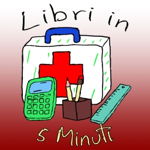

# **Libri in 5 Minuti**

Collezione di Recensioni e Trame di Libri YA (Young Adult - per adolescenti). Tutto ciò che dovete sapere in modo sintetico e completo.

  

## **Playlist complete (Link su Youtube)**

  <a href="https://www.youtube.com/watch?v=xfG6tgX9wLM&list=PL8nSPrZb28LSWSMI0PIekshXIe-4rizZz">
    

## **Lista link alle Libri in 5 Minuti**

## **. $${\color{orange}Playlist \space Linri \space in \space 5 \space Minuti}$$**

  <h2>Libri in 5 Minuti - Trame e Recensioni</h2>

  

  

  
Harry Potter e la pietra filosofale - Trama del libro — Harry Potter e la pietra filosofale - Recensione

  

