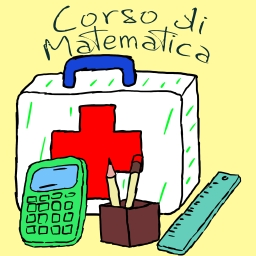
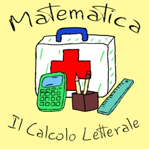

# **Corso di Matematica**

 - **Corso di Matematica**
   - Corso organizzato per lezioni e per macro-argomenti. Ogni macro-argomento è suddiviso in lezioni di circa 10 minuti. Sono disponibili anche delle playlist specifiche organizzate per singolo macro-argomento.
<!---
 - **Matematica tutto d’un fiato**
   - Video completi di ogni macro-argomento in cui sono messe assieme e in modo ordinato tutte le lezioni
 - **Matematica – Flashcards (Tablet o Smartphone)**
   - Serie di video “shorts” ricavati dalle lezioni. Sono video di durata inferiore al minuto (**flashcards**) che possono essere scorsi velocemente allo scopo di facilitare il ripasso o semplicemente per curiosità. Sono disponibili anche delle playlist specifiche organizzate per singolo macro-argomento.
-->
  

  

## **Playlist complete**

       
  <!---
   
   
  -->

  

#  **$${\color{orange} Macro-Argomenti }$$**

<!---
## **Il Calcolo Letterale e i Monomi. Definizioni, Proprietà, Somme, Sottrazioni, Prodotti, Divisioni, MCD e mcm. Esempi ed Esercizi $${\color{orange}Playlist \space lezioni \space singole \space – \space Video \space con \space tutte \space le \space lezioni \space – \space Flashcards \space ( \space Video \space Short \space Verticali )}$$**
-->
## **Il Calcolo Letterale e i Monomi. Definizioni, Proprietà, Somme, Sottrazioni, Prodotti, Divisioni, MCD e mcm. Esempi ed Esercizi $${\color{orange}Playlist \space lezioni \space singole}$$**

    
  <!---
     
   
  -->

  <h2>Lezioni Singole</h2>

  
  
  
  
  
  
  
  
  

  

  

