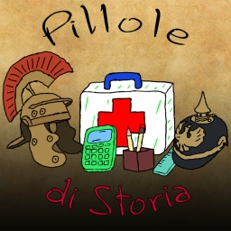

# **Pillole di Storia**

Raccolta di brevi video su curiosità e argomenti di cultura generale. Tutto ciò che dovete sapere in modo sintetico e completo.

  

## **Playlist complete (Link su Youtube)**

  <a href="https://www.youtube.com/watch?v=hp5HbJyu99s&list=PL8nSPrZb28LQtydTAPQ2NDifmkGimpkYX">
    

## **Lista link alle Pillole di Storia**

## **. $${\color{orange}Playlist \space Pillole \space di \space curiosità}$$**

  <h2>Pillole</h2>

  

  

  
Adolf Hitler – Parte IV – La Seconda Guerra Mondiale e la morte — Adolf Hitler – Parte III – Il Regime Nazista e la genesi della Seconda Guerra Mondiale

  

  

  
Adolf Hitler – Parte II – L'ascesa politica e il Partito Nazista — Adolf Hitler – Parte I – dalle origini alla Prima Guerra Mondiale

  

