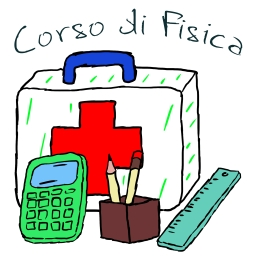

# Pronto Soccorso Studenti
Benvenuti e benvenute  nel repository del canale di “Pronto soccorso studenti”, il canale tematico pensato per fornire supporto agli studenti in merito alle materie scientifiche ma non solo.   
Qui troverete i link al canale ed ai video caricati su Youtube, organizzati in modo semplice e funzionale.  
Sotto il link per accedere dierettamente al canale.  

$${\color{red}Red}$$
$${\color{red}uno}$$

  

  <a href="https://www.youtube.com/channel/UCbPZP1NdbHJ8ZCrzPoYSNLw">Visita il canale Youtube Pronto Soccorso Studenti</a>

<!--

--> 

<!--

--> 

Il canale ad oggi è suddiviso in 2 sezioni:

 - **Lezioni/Corso di Fisica**
 - **Pillole di curiosità**
<!--

-->

  
  

## Lezioni di Fisica

La prima sezione è destinata alle lezioni di Fisica per le scuole superiori. Per questa materia sono disponibili diverse playlists:  
 - **Corso di Fisica**
   - Corso organizzato per lezioni e per macro-argomenti. Ogni macro-argomento è suddiviso in lezioni di circa 10 minuti. Sono disponibili anche delle playlist organizzate per singolo macro-argomento:
     - **Grandezze Fisiche e Sistema Internazionale di Unità di Misura**
     - **Misure di Grandezze Fisiche**
     - **I Vettori e gli Scalari**
     - **Le Forze**
 - **Fisica tutto d’un fiato**
   - Video completi di ogni macro-argomento in cui sono messe assieme e in modo ordinato tutte le lezioni
 - **Fisica – Flashcards (Tablet o Smartphone)**
   - Serie di video “shorts” ricavati dalle lezioni. Sono video di durata inferiore al minuto (**flashcards**) che possono essere scorsi velocemente allo scopo di facilitare il ripasso o semplicemente per curiosità. Sono disponibili anche delle playlist organizzate per singolo macro-argomento:
     - **Grandezze Fisiche e Sistema Internazionale di Unità di Misura**
     - **Misure di Grandezze Fisiche**
     - **I Vettori e gli Scalari**
     - **Le Forze**

## Pillole di Curiosità

La seconda sezione è quella delle “Pillole di curiosità”. Si tratta di brevi video in cui condivido con voi alcune curiosità, in genere di carattere scientifico, ma non solo. Per questa materia sono disponibili 2 playlists:  
 - **Pillole di Curiosità**
 - **Pillole di Curiosità – Flashcards (Tablet o Smartphone)**
   - Serie di video “shorts” ricavati dalle Pillole di Curiosità. Sono video di durata inferiore al minuto (**flashcards**) che possono essere scorsi velocemente
