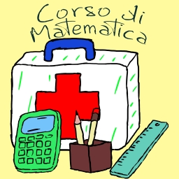

# $${\color{yellow}Pronto \space Soccorso \space Studenti}$$
Benvenuti e benvenute nel repository del canale di $${\color{orange}“Pronto \space soccorso \space studenti”}$$, il canale tematico pensato per fornire supporto agli studenti in merito alle materie scientifiche ma non solo.
Qui troverete i link al canale ed ai video caricati su $${\color{orange}Youtube}$$, organizzati in modo semplice e funzionale.
Sotto il link per accedere direttamente al canale.

  

  <a href="https://www.youtube.com/channel/UCbPZP1NdbHJ8ZCrzPoYSNLw">Visita il canale Youtube Pronto Soccorso Studenti</a>

Il canale ad oggi è suddiviso nelle seguenti sezioni:

 - **Lezioni/Corso di Matematica** <a href="Matematica/Readme.md" title="Pagina Lezioni/Corso di Matematica "> • Pagina Link Video su Youtube </a>
 - **Lezioni/Corso di Fisica** <a href="Fisica/Readme.md" title="Pagina Lezioni/Corso di Fisica "> • Pagina Link Video su Youtube </a>
 - **Appunti di Storia** <a href="Storia/Readme.md" title="Pagina Appunti di Storia "> • Pagina Link Video su Youtube </a>
 - **Pillole di Curiosità**  <a href="Pillole_di_Curiosita/Readme.md" title="Pagina Pillole di Curiosità "> • Pagina Link Video su Youtube </a>
 - **Pillole di Storia**  <a href="Pillole_di_Storia/Readme.md" title="Pagina Pillole di Storia "> • Pagina Link Video su Youtube </a>
 - **Libri in 5 Minuti**  <a href="Libri_in_5_Minuti/Readme.md" title="Libri in 5 Minuti "> • Pagina Link Video su Youtube </a>

  
  
  
  
  
  

## $${\color{orange}Lezioni \space di \space Matematica}$$

La prima sezione è destinata alle lezioni di Matematica per le scuole superiori. Per questa materia sono disponibili diverse playlists:
 - **Corso di Matematica**
   - Corso organizzato per lezioni e per macro-argomenti. Ogni macro-argomento è suddiviso in lezioni di circa 10 minuti. Sono disponibili anche delle playlist organizzate per singolo macro-argomento:
     - **Il Calcolo Letterale e i Monomi**
     - **I Polinomi**
 - **Matematica tutto d’un fiato**
   - Video completi di ogni macro-argomento in cui sono messe assieme e in modo ordinato tutte le lezioni (in futuro)
 - **Matematica – Flashcards (Tablet o Smartphone)**
   - Serie di video “shorts” ricavati dalle lezioni. Sono video di durata inferiore al minuto (**flashcards**) che possono essere scorsi velocemente allo scopo di facilitare il ripasso o semplicemente per curiosità. Sono disponibili anche delle playlist organizzate per singolo macro-argomento:
     - **Il Calcolo Letterale e i Monomi (in futuro)**
     - **I Polinomi (in futuro)**

## $${\color{orange}Lezioni \space di \space Fisica}$$

La Seconda sezione è destinata alle lezioni di Fisica per le scuole superiori. Per questa materia sono disponibili diverse playlists:
 - **Corso di Fisica**
   - Corso organizzato per lezioni e per macro-argomenti. Ogni macro-argomento è suddiviso in lezioni di circa 10 minuti. Sono disponibili anche delle playlist organizzate per singolo macro-argomento:
     - **Grandezze Fisiche e Sistema Internazionale di Unità di Misura**
     - **Misure di Grandezze Fisiche**
     - **Rappresentazione Dati**
     - **I Vettori e gli Scalari**
     - **Le Forze**
 - **Fisica tutto d’un fiato**
   - Video completi di ogni macro-argomento in cui sono messe assieme e in modo ordinato tutte le lezioni
 - **Fisica – Flashcards (Tablet o Smartphone)**
   - Serie di video “shorts” ricavati dalle lezioni. Sono video di durata inferiore al minuto (**flashcards**) che possono essere scorsi velocemente allo scopo di facilitare il ripasso o semplicemente per curiosità. Sono disponibili anche delle playlist organizzate per singolo macro-argomento:
     - **Grandezze Fisiche e Sistema Internazionale di Unità di Misura**
     - **Misure di Grandezze Fisiche**
     - **Rappresentazione Dati**
     - **I Vettori e gli Scalari**
     - **Le Forze**

## $${\color{orange}Appunti \space di \space Storia}$$

La terza sezione è destinata agli appunti di Storia per le scuole superiori. Per questa materia sono disponibili diverse playlists:
 - **Appunti di Storia**
   - Appunti organizzato per argomenti e per macro-argomenti. Ogni macro-argomento è suddiviso in lezioni di circa 10 minuti. Sono disponibili anche delle playlist organizzate per singolo macro-argomento:
     - **La Preistoria**
 - **Storia tutto d’un fiato**
   - Video completi di ogni macro-argomento in cui sono messe assieme e in modo ordinato tutte le lezioni (in futuro)
 - **Storia – Flashcards (Tablet o Smartphone)**
   - Serie di video “shorts” ricavati dalle lezioni. Sono video di durata inferiore al minuto (**flashcards**) che possono essere scorsi velocemente allo scopo di facilitare il ripasso o semplicemente per curiosità. Sono disponibili anche delle playlist organizzate per singolo macro-argomento:
     - **La Preistoria (in futuro)**

## $${\color{orange}Pillole \space di \space Curiosità}$$

La quarta sezione è quella delle “Pillole di Curiosità”. Si tratta di brevi video in cui condivido con voi alcune curiosità, in genere di carattere scientifico, ma non solo. Per questa materia sono disponibili 2 playlists:
 - **Pillole di Curiosità**
 - **Pillole di Curiosità – Flashcards (Tablet o Smartphone)**
   - Serie di video “shorts” ricavati dalle Pillole di Curiosità. Sono video di durata inferiore al minuto (**flashcards**) che possono essere scorsi velocemente

## $${\color{orange}Pillole \space di \space Storia}$$

La quinta sezione è quella delle “Pillole di Storia”. Si tratta di brevi video in cui condivido con voi alcune curiosità storiche in merito ad eventi, personaggi e luoghi. Per questo argomento sono disponibili 2 playlists:
 - **Pillole di Storia**
 - **Pillole di Storia – Flashcards (Tablet o Smartphone)**
   - Serie di video “shorts” ricavati dalle Pillole di Curiosità. Sono video di durata inferiore al minuto (**flashcards**) che possono essere scorsi velocemente (in futuro)

## $${\color{orange}Libri \space in \space 5 \space Minuti}$$

La sesta sezione è quella di “Libri in 5 Minuti”. Si tratta di una collezione di Recensioni e Trame di Libri YA (Young Adult - per adolescenti). Tutto ciò che dovete sapere in modo sintetico e completo. Per questo argomento è disponibile una playlist:
 - **Libri in 5 minuti**
