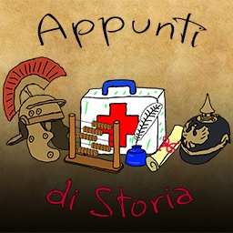
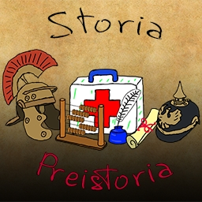

# **Appunti di Storia**

 - **Appunti di Storia**
   - Appunti organizzati per lezioni e per macro-argomenti. Ogni macro-argomento è suddiviso in lezioni di circa 10 minuti. Sono disponibili anche delle playlist specifiche organizzate per singolo macro-argomento.

  

## **Playlist complete (Link su Youtube)**

  

  

#  **$${\color{orange} Macro-Argomenti }$$**

## **La Preistoria. $${\color{orange}Playlist \space lezioni \space singole \space – \space Video \space con \space tutte \space le \space lezioni}$$**

  

  <h2>Lezioni Singole</h2>

  

  

  
La Preistoria Parte I – L’evoluzione dell’uomo e le 3 Età della Pietra — La Preistoria Parte II – Le 3 età della Pietra: Paleolitico, Mesolitico e Neolitico

  

  
La Preistoria Parte III – L’evoluzione della civiltà nel Neolitico

  

